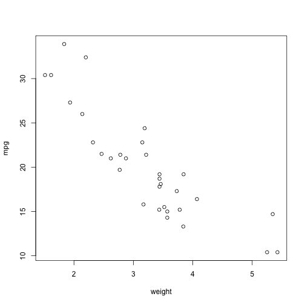

R_slides for Data Product Course
========================================================
author: X. Zeng
date: 2015-08-16

Introduction
========================================================

Data Product Course is very useful for bring your work to the public.

- First, you need to learn R.
- Second, you need to learn shiny.
- Third, you need to learn slidy.

Here is a mtcars example.
========================================================

We show the first 5 lines of mtcars dataset:

```r
head(mtcars,5)
```

```
                   mpg cyl disp  hp drat    wt  qsec vs am gear carb
Mazda RX4         21.0   6  160 110 3.90 2.620 16.46  0  1    4    4
Mazda RX4 Wag     21.0   6  160 110 3.90 2.875 17.02  0  1    4    4
Datsun 710        22.8   4  108  93 3.85 2.320 18.61  1  1    4    1
Hornet 4 Drive    21.4   6  258 110 3.08 3.215 19.44  1  0    3    1
Hornet Sportabout 18.7   8  360 175 3.15 3.440 17.02  0  0    3    2
```

Plot mpg vs weight in mtcars
========================================================

 

Hope you enjoy the presentaion so far!
========================================================

Thank you for your time!

